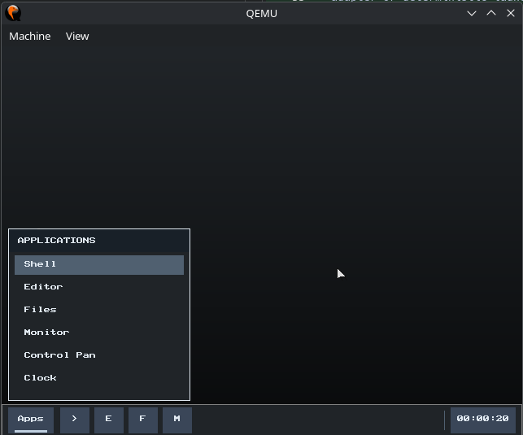

# ArmoniOS

> A small freestanding AArch64 operating system with a graphical QEMU desktop,
> inspired by the compact, direct design of KolibriOS and MenuetOS.

[](LICENSE)
[]()
[]()
[]()

<p align="center">
  
</p>

## Preview



## Current status

ArmoniOS is a **real bare-metal AArch64 operating system** with a verified QEMU
`virt` desktop baseline. It is not a hosted Linux application or distribution.

- **public baseline:** v0.1 QEMU desktop;
- **engineering phase:** v0.2 cleanup and runtime hardening;
- **next release blockers:** redraw/global-time bounds and sustained-load proof;
- **product target:** v1.0 usable QEMU mini desktop;
- **hardware:** Raspberry Pi scaffolding only, not hardware-supported.

Runtime measurement Phase 1B is complete for the work classes observable on
QEMU. Phase 2 currently enforces these count bounds:

| Work class | Current post-EOI bound |
|---|---:|
| Virtio-input producer | At most 16 used descriptors per call |
| USB HID producer | At most four registered device visits per call |
| Shared input consumer | At most 16 queued events per pass |
| Virtio-net RX | At most 16 valid frames per pass |

Virtio-input leaves later used descriptors in its ring for the next periodic
pass. USB covers every supported slot because the fixed device array has four
entries. Input readiness and network readiness have independent pending bits.
Input requeues only when the shared queue still contains events; network uses a
conservative rule, so exactly 16 frames may schedule one empty follow-up pass.

This is **not** complete runtime bounding. Redraw/damage work and total service
time still lack enforced budgets, cooperative network polling outside the
bottom half remains outside the network guarantee, and no sustained-load QEMU
test yet proves EL0 progress. `RISK-017` remains open and v0.2 is not promoted.

The latest validated implementation head is
`ee92e8074ed2995a48ce22fb88a901ea02cf031d`:

- `Verify ArmoniOS` run `29859659229`: success;
- `CI - Tests` run `29859659270`: success;
- loadable QEMU kernel: **107706 / 108000 bytes**;
- remaining size margin: **294 bytes**;
- producer-bound merges: PR #55 `53c1440261267b36e813fb90e6405261ec7bbfad`
  and PR #56 `7674b639b9a53dea4cec42bcccf84e71d7f6d10c`.

The virtio-net path still exposes no trustworthy device-drop or ring-overflow
counter. Consumed-frame counts are not proof that no packet was lost before
software observed it.

## What works

The QEMU codebase includes:

- AArch64 EL1 boot with DTB handoff;
- PMM, heap, 4 KiB page tables, MMU, and kernel W^X;
- preemptive freestanding EL0 processes with private image, stack, anonymous
  mappings, parent/wait, kill, exit, and zombie cleanup;
- a small non-POSIX syscall ABI with permission-aware user pointers and
  kernel-owned syscall payloads;
- process-local VFS descriptors;
- bootfs, tmpfs, and a writable root-only FAT32 bridge;
- a kernel-owned compositor with focus, dragging, minimize/restore, backing
  buffers, damage tracking, and event queues;
- `panel`, `shell`, `editor`, `files`, `monitor`, `control`, and `clock`;
- QEMU virtio block, GPU, input, and network;
- PCI/xHCI and directly attached boot-protocol USB HID;
- Ethernet, ARP, IPv4, UDP, and DHCP for a QEMU user-network lease;
- one post-EOI deferred runtime service with aggregate and per-class telemetry;
- deterministic host, QEMU, size, stack, ABI, storage, GUI, USB, network, and
  board-build gates.

## Important limits

| Area | Current limit |
|---|---|
| Runtime platform | QEMU `virt` is the only verified runtime target. |
| Physical memory | PMM manages at most 128 MiB. |
| Processes | 16 slots and eight tracked user regions each. |
| VFS | 24 nodes, four mounts, eight descriptors/process, 64-byte paths. |
| FAT32 | Root directory, short 8.3 names, no subdirectories or LFN. |
| Editor | 512-byte buffer; only the caret line is rendered. |
| Files | `/fat` only; at most eight displayed root entries. |
| GUI | 16 windows, 32 events/window, 32 damage rectangles. |
| Input queue | 64 events; overflow is counted but not prevented. |
| Virtio input | Negotiated ring up to 16; at most one ring-length drained/call. |
| USB HID | Four devices; at most four device polls/call; no hubs. |
| Network RX | 16 valid frames/post-EOI pass; device drops unavailable. |
| Networking API | No socket ABI, TCP, DNS API, or HTTP. |
| Scheduling | EL0 preemptive; EL1 helper threads cooperative. |
| Runtime service | Runs after EOI but before `eret`; redraw and total time remain unbounded. |
| User copy | Permission checked, but final copies are not fault-recoverable. |
| Raspberry Pi | Build/host scaffolding only; no physical support claim. |

Read [Current State](docs/CURRENT_STATE.md) and
[Technical Risks](docs/TECHNICAL_RISKS.md) before making release claims.

## Quick start

### Requirements

On Ubuntu or WSL2:

```bash
sudo apt update && sudo apt install -y \
  qemu-system-arm \
  gcc-aarch64-linux-gnu \
  binutils-aarch64-linux-gnu \
  gdb-multiarch \
  make
```

### Verify the automated baseline

```bash
git clone https://github.com/roccolate/armonios
cd armonios
bash tools/verify.sh
```

The gate covers QEMU/RPi4 builds, `.data == 0`, the 108000-byte ceiling,
native subsystem tests, runtime timing and count budgets, userland stack usage,
FAT32 smoke, user-copy/focus regressions, framebuffer, USB, DHCP, and visible
FAT+GPU wiring.

Useful focused commands:

```bash
make BOARD=qemu_virt
make BOARD=qemu_virt size
make -C tests test
bash tests/run_runtime_service_test.sh
bash tests/run_input_queue_stats_test.sh
make stack-check
make qemu-fs-test
bash tools/qemu_usercopy_test.sh
bash tools/qemu_focus_test.sh
bash tools/qemu_marker_test.sh all
bash tools/qemu_fb_fat_test.sh
```

### Run QEMU

```bash
make qemu
```

Exit with `Ctrl+A`, then `X`.

### Run the visible desktop

```bash
make qemu-fb-visible
```

The latest recorded manual workflow is from 2026-07-17. Rocco listed `/fat`,
created an 8.3 file, opened Editor, typed and saved, closed, renamed, reopened
with content intact, deleted, and refreshed. Manual evidence is separate from
automated serial markers.

## Runtime architecture

```text
physical timer IRQ
  -> fixed account/rearm/publish PERIODIC | INPUT | NETWORK readiness
  -> EOI
  -> measured post-EOI runtime pass
       -> periodic producer/GUI phase
            -> virtio-input: <=16 used descriptors/call
            -> USB HID: <=4 device visits/call
            -> shared input queue: <=16 events/pass when INPUT is pending
            -> dirty compositor redraw (not yet globally/time bounded)
       -> independently pending network phase
            -> <=16 valid RX frames
            -> conservative requeue when cap is reached
  -> process dispatch
  -> eret
```

EOI completes the interrupt-controller transaction but does not leave the CPU
exception. EL0 remains paused during the service pass. Count bounds now cover
input producers, input consumption, and post-EOI network RX; the complete pass
still has no global duration guarantee.

See [Deferred Runtime Service](docs/RUNTIME_SERVICE.md).

## Storage and applications

The current FAT32 path supports 512-byte sectors, root 8.3 files, cluster growth,
create/read/write/list/rename/delete, and `/fat/<name>` VFS nodes. It is not a
general FAT implementation.

The applications are useful demonstrations, not complete daily tools:

- **Files:** root-only `/fat` browser and basic 8.3 operations;
- **Editor:** small text buffer, caret editing, save, and a one-line viewport;
- **Shell:** history, scrollback, and basic file/process/system commands;
- **Panel:** launcher, taskbar, focus, minimize, and restore;
- **Monitor, Control, Clock:** compact system and desktop demonstrations.

Issue #2 tracks **v0.6 useful desktop applications**. It depends on v0.3
storage/path infrastructure, v0.4 real FAT, and v0.5 shared runtime/widgets.

## Raspberry Pi

The `rpi4` backend and opt-in read-only EMMC2 diagnostic image build and pass host
tests. Normal board capabilities remain fail closed.

ArmoniOS does not claim physical Raspberry Pi boot, working SD/eMMC, framebuffer,
input, or an installable Raspberry Pi desktop image.

## Documentation

- [Current State](docs/CURRENT_STATE.md)
- [Technical Risks](docs/TECHNICAL_RISKS.md)
- [Roadmap](docs/ROADMAP.md)
- [Architecture](docs/ARCHITECTURE.md)
- [Deferred Runtime Service](docs/RUNTIME_SERVICE.md)
- [Memory Map](docs/MEMORY_MAP.md)
- [Syscalls](docs/SYSCALLS.md)
- [GUI ABI Notes](docs/GUI_ABI_NOTES.md)
- [Documentation Policy](docs/DOCUMENTATION_POLICY.md)
- [Contributing](docs/CONTRIBUTING.md)
- [Porting](docs/PORTING.md)

## Road to v1.0

1. Bound redraw/damage and total runtime time, then prove EL0 progress under
   sustained load.
2. Promote v0.2 with dated automated and visible evidence.
3. Build v0.3 block/VFS/path infrastructure.
4. Add real FAT support.
5. Add shared userland runtime/widgets.
6. Complete v0.6 Files, Editor, Shell, Settings, Monitor, Panel, and Clock.
7. Mount ext2 read-only.
8. Stabilize, fuzz, document, and record the final workflow.

## Project structure

```text
boot/                 AArch64 entry and early setup
kernel/               kernel, exceptions, processes, syscalls, VFS, GUI
kernel/mm/            PMM, VMM, heap
kernel/sched/         cooperative EL1 helper scheduler
drivers/              board boundary and device drivers
programs/apps/         freestanding KLI1 applications
programs/libkarm/      syscall and small userland helpers
programs/libkarmdesk/  GUI wrappers
tests/                host and contract tests
tools/                build, QEMU, and verification utilities
docs/                 architecture, ABI, status, risks, policy
```

## Design principles

- Keep the kernel small, explicit, and readable.
- Prefer direct C and narrow AArch64 assembly boundaries.
- Treat QEMU as the regression platform until hardware is proven.
- Separate implementation from verified behavior.
- Keep hard IRQ callbacks bounded.
- Compact or redesign before raising size limits.
- Add tests and documentation with behavior changes.

## License

ArmoniOS is licensed under [GNU GPL-2.0](LICENSE).
